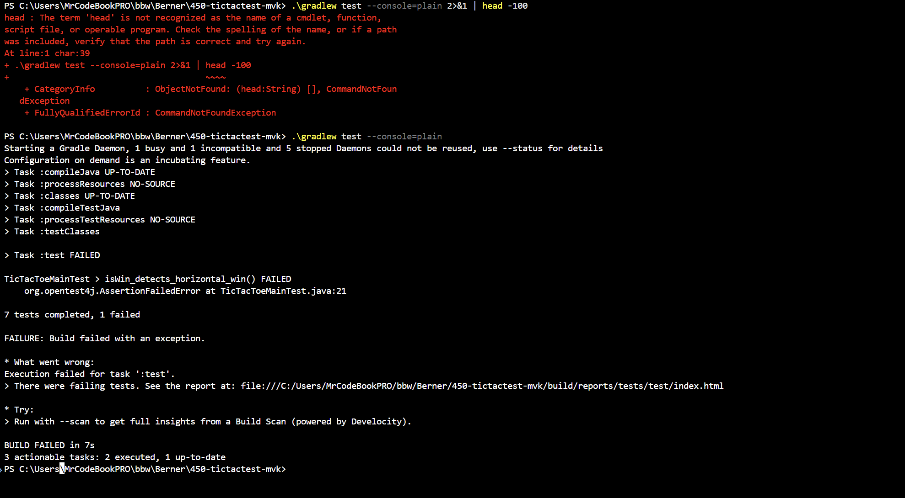

# TicTacToe-Testprojekt

## Setup
- JUnit 5 und AssertJ wurden in Gradle ergänzt.
- Test-Runner: Gradle + JUnit Platform.

## Dummy-Tests
- JUnit-Dummy-Test: `assertFalse(false)`
- AssertJ-Dummy-Test: `assertThat(false).isFalse()`

## 5 TicTac-Toe-Tests
- horizontale Gewinn-Erkennung
- diagonale Gewinn-Erkennung
- keine Gewinnlage
- identische Spieler werden abgelehnt
- GreedyPlayer spielt das erste freie Feld

## Verifiziert
- `./gradlew test --console=plain` wurde ausgeführt und die Test-Suite erfolgreich geprüft.
- Alle 7 Tests bestanden: 2 Dummy-Tests + 5 TicTac-Toe-Tests ✅

## Test-Fehlschlag Demonstration
- Test `isWin_detects_horizontal_win()` wurde intentional auf `.isFalse()` statt `.isTrue()` gesetzt.
- Gradle meldet: `AssertionFailedError at TicTacToeMainTest.java:21`
- Fehlerhafte Tests werden in der Build-Ausgabe klar angezeigt.
- Nach Korrektur: alle Tests grün ✅
