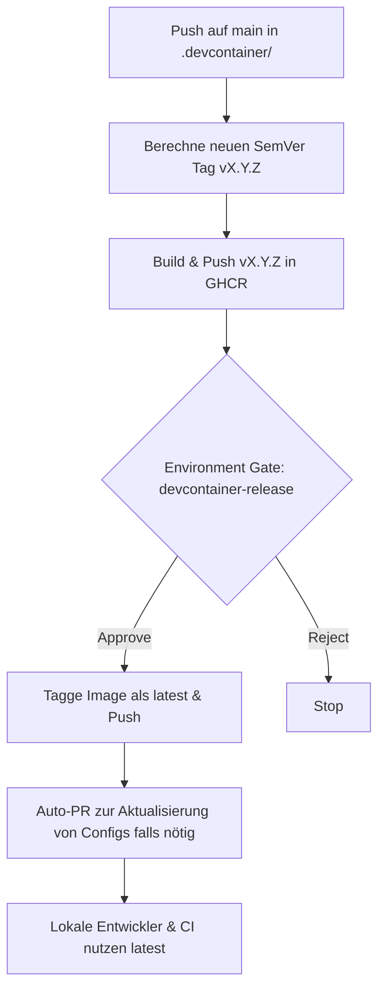

# DevContainer Continuous Deployment (CD)

## Ist-Zustand vs Soll-Zustand
Vorher wurde bei jedem Push der DevContainer neu gebaut oder direkt nach `latest` gepusht, ohne Versionierung und ohne Review-Prozess. Die lokale Umgebung baute das Image jedes Mal lokal (`build` in `devcontainer.json`).

## Versionierungskonzept
- **Semantic Versioning (SemVer):** Das DevContainer Image wird nach Semantic Versioning getaggt (z.B. `v1.0.0`, `v1.0.1`).
- **Immutable Tags:** Sobald eine Version gebaut und in die GitHub Container Registry (GHCR) gepusht wurde, ist der Tag (`vX.Y.Z`) unveränderlich.
- **`latest`-Tag:** Der `latest`-Tag zeigt stets auf die *zuletzt offiziell freigegebene* Version, nicht auf den letzten Entwicklungsstand.

## Freigabeprozess (Gating)
Um zu verhindern, dass ungeprüfte oder defekte Container-Images ins Team gelangen, gibt es einen manuellen Freigabeprozess:
1. **Automatischer Build:** Bei Änderungen im `.devcontainer/**` Ordner auf dem `main` Branch wird automatisch eine neue Version hochgestuft (Patch) und das Image unter diesem neuen Tag (z.B. `v1.0.2`) gepusht.
2. **Review-Gate (Environment):** Der nächste Job, der den `latest`-Tag umbiegt, wartet auf ein manuelles Approval in der GitHub Environment `devcontainer-release`.
3. **Freigabe:** Erst nach Bestätigung durch einen Reviewer wird das Image als `latest` markiert.

## Auto-PR
Nach der erfolgreichen Freigabe (Push auf `latest`) erstellt die Pipeline automatisch einen Pull Request. Dieser PR trägt sicher, dass auch in Zukunft alle Entwickler über etwaige manuelle Versionierungs-Pins informiert werden können (in unserem Fall nutzt die `devcontainer.json` den `latest`-Tag, der immer sicher ist).

## CI & Lokale Nutzung
- Die Datei `CI.yaml` referenziert das DevContainer-Image direkt (oder läuft in einer Umgebung, die davon profitiert).
- Die Datei `.devcontainer/devcontainer.json` wurde von lokalem Build auf `"image": "ghcr.io/mrcodebs/450-tictactest-mvk-devcontainer:latest"` umgestellt. Lokale Umgebungen laden nun immer die offiziell freigegebene, neueste Version herunter.

## Workflow Diagramm

